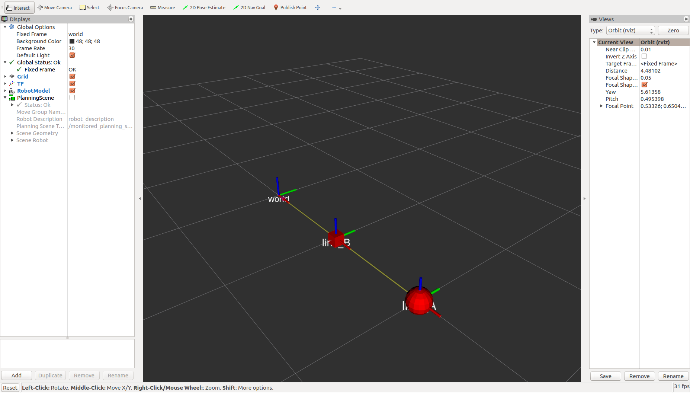
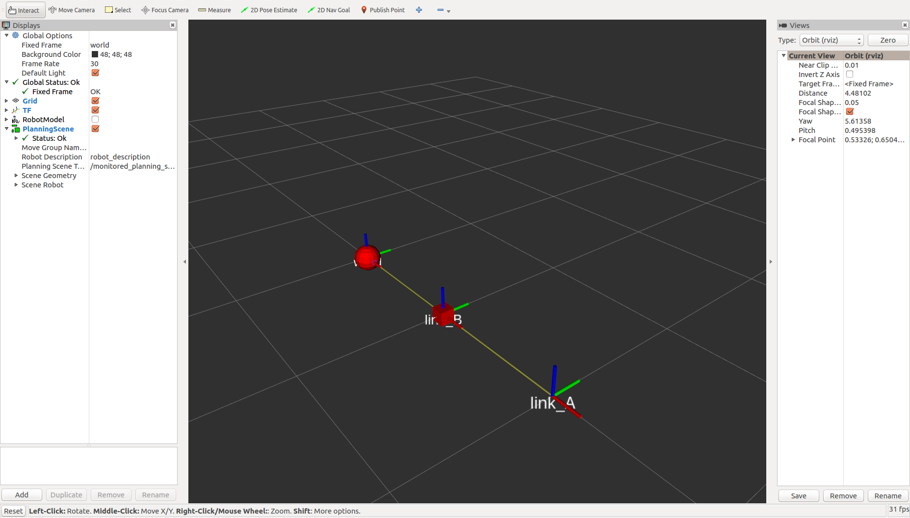
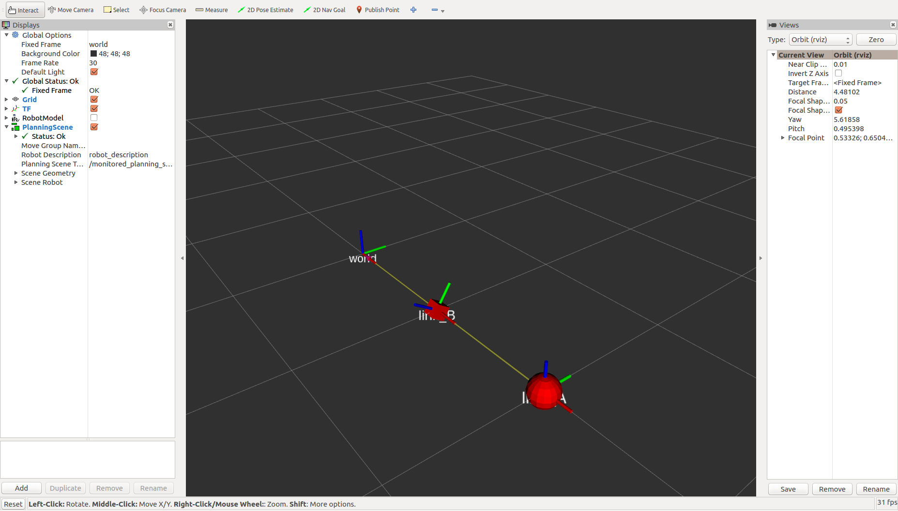
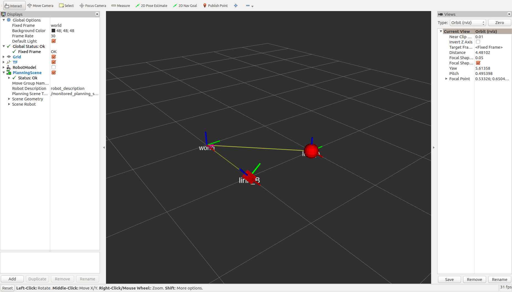

This package demonstrates a bug in the `moveit_ros_visualization/PlanningScene`-display for Rviz in Moveit version 0.9.12 (see https://github.com/ros-planning/moveit), where floating joints in the planning scene are not displayed correctly until a 1-DOF joint is updated.

# Installation

(It is assumed you have a ROS Kinetic environment un Ubuntu 16.04 with moviet 0.9.12 already installed.)

* Clone the repository into your workspace: `git clone https://github.com/xaver-k/rviz_plugin_offset_test.git`
* Install dependencies: `rosdep install rviz_plugin_offset_test`
* Build: `catkin build`


# Reproducing the Bug

* Launch the demo environment: ` roslaunch rviz_plugin_offset_test test_environment.launch `.
  Rviz starts and shows the robot model:
  

* In Rviz, deactivate the robot model and activate the planning scene display (this may take a moment).
  Do NOT use the `joint_state_publisher`-window.
  While we expect that the model in the planning scene display and the previous robot model are identical, the position of the link attached to the floating joint (sphere) is wrong.
  

## Further interesting behavior

(continue from the state above)

* In the `joint_state_publisher`-window, modify the joint angle for the joint `world_to_link_B`.
  As soon as we have a **change** in the joint angle, the correct transform for the floating joint is displayed:
  

* In a terminal, kill the node that publishes the transformation for the floating joint and start an other publisher, which publishes a different transform:
  ```
  rosnode kill /world_to_link_A_tf_publisher && rosrun tf static_transform_publisher 1 1 0 0 0 0 world link_A 100
  ```
  The floating joint transformation is adjusted immediately in rviz:
  
